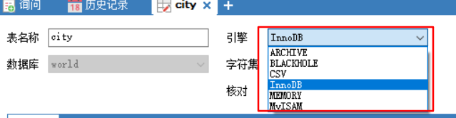
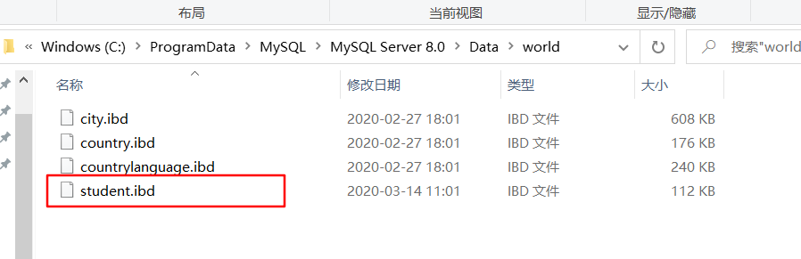
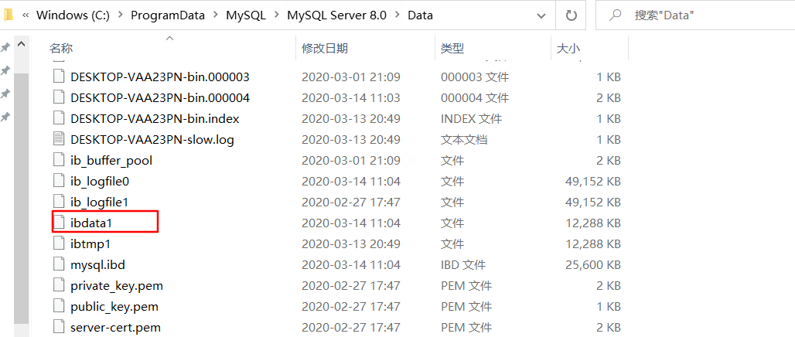
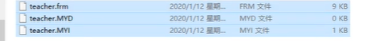
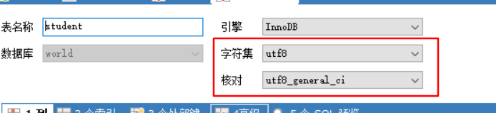

# 创建表

## 建表语句 

#### 创建学生表(列，字段) 使用SQL创建

--学号int登录密码varchar(20)姓名，性别varchar (2),出生日期(datatime),家庭住址, email
--注意点，使用英文()，表的名称和字段尽量使用“括起来

```sql
 CREATE TABLE IF NOT EXISTS `student`(
	`id` INT(4) NOT NULL AUTO_INCREMENT COMMENT '学号',
	`name` VARCHAR(30) NOT NULL DEFAULT '匿名' COMMENT '姓名',
	`pwd` VARCHAR (20) NOT NULL DEFAULT '123456' COMMENT '密码',
	`sex` VARCHAR(2) NOT NULL DEFAULT '女' COMMENT '性别',
	`birthday`  DATETIME DEFAULT NULL COMMENT '出生日期',
	`address` VARCHAR(100) DEFAULT NULL COMMENT '家庭住址',
	`email` VARCHAR (50) DEFAULT NULL COMMENT '邮箱',
	PRIMARY KEY(`id`)`student`
 )ENGINE = INNODB DEFAULT CHARSET=utf8
```

#### 格式

```sql
CREATE TABLE [IF NOT EXISTS] `table_name`(
	'字段名' 列类型 属性 索引 注释，
	'字段名' 列类型 属性 索引 注释
)表类型 字符集设置 注释
```

#### 显示建数据库、表语句：

```sql
SHOW CREATE DATABASE school
SHOW CREATE TABLE student
DESC student 显示表结构
```

## 数据表的引擎

### 基本信息



* InnoDB    
  * 默认生成，安全性高，事务处理，多表多用户操作

* MyISAM   早些年使用
  * 节约空间，速度快

|              | MyISAM | InnoDB        |
| ------------ | ------ | ------------- |
| 事务支持     | 不支持 | 支持          |
| 数据行锁定   | 不支持 | 支持          |
| 外键         | 不支持 | 支持          |
| 全文索引     | 支持   | 不支持        |
| 表空间的大小 | 较小   | 较大，约为2倍 |

### 物理空间位置

* InnoDB
  * 数据库的ibd文件
  * Data目录的ibdata1文件





* MyISAM
  * .frm   -表结构定义文件
  * .MYD   -数据文件
  * .MYI  -索引文件



## 字符集编码



# 修改表

##### 1.修改表名

```SQL
ALTER TABLE teacher RENAME AS teacher1
```

##### 2.增加表的字段

```SQL
ALTER TABLE teacher ADD age INT(11)
```

##### 3.修改表的字段属性和名字

```SQL
ALTER TABLE teacher1 MODIFY age VARCHAR(11) -修改属性
ALTER TABLE teacher1 CHANGE age age1 INT(1) -修改名称
```

##### 4.删除表的字段

```sql
ALTER TABLE teacher1 DROP age1
```

##### 5.删除表

```sql
DROP TABLE IF EXISTS teacher1
```

