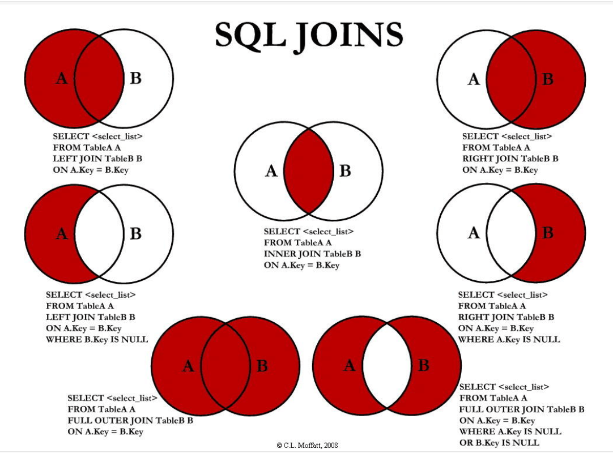

备注：笔者学习时已经有了相当的经验，只记录一些规则作为备查，不列出特别多的例子

### 1.外键（数据库级别）

* 在数据库级别关联外键关系后，被引用的表不能删除。
* 建表时关联：
  * 定义外键key
  * 给这个外键添加约束

```sql
 CREATE TABLE IF NOT EXISTS `student`(
	`id` INT(4) NOT NULL AUTO_INCREMENT COMMENT '学号',
	`gradeid` INT(10) NOT NULL '年级'
	 PRIMARY KEY(`id`)`student`,
     key `FK_gradeid` (`gradeid`),
     constraint `FK_gradeid` foreign key (`gradeid`) references `grade`(`gradeid`)
 )ENGINE = INNODB DEFAULT CHARSET=utf8

```

* 随时关联

```sql
alter table `student`
add constraint `FK_gradeid` foreign key (`gradeid`) reference `grade`(`gradeid`)
```

### 2.DML语言

* #### insert

```sql
insert into table_name (field1,field2....) values ('value1','value2'....),('value1','value2'....),....
```

* #### update

```sql
update table_name set field1='value1',field2='value2'....  
where ...
```

* #### delete

```sql
delete from table_name where ..
```

* #### truncate

```sql
truncate table_name
```

*  truncate和delete区别
  * 都能删除数据
  * truncate重新设置自增列，计数器会归零
  * truncate不会影响事务

### 3.DQL查询语句

* #### concat( field1,field2)

  * 用于拼接数据


* #### distinct  

  * 去除重复

* #### 模糊查询

  * is null
  * is not null
  * between
  * like
    * %--任意多个字符
    * _--一个字符
  * in

* #### 联表查询



```sql
from table_a 
left join table_b on a.id = b.a_id
inner join table_c on a.id = c.a_id
where ...
```

* #### limit

  * limit a,b，查询第a条到第a+1条的数据。

```sql
from table_a 
where ...
order by ...
limit 1,5
```

### 4.常用函数

#### 数学函数

| 方法名    | 结果                |
| --------- | ------------------- |
| ABS()     | 绝对值              |
| CEILING() | 向上取整            |
| FLOOR()   | 向下取整            |
| RAND()    | 返回一个0~1的随机数 |
| SIGN()    | 判断一个数的符号    |

#### 字符串函数

| 方法名          | 结果                             |
| --------------- | -------------------------------- |
| CHAR_LENGTH     | 字符串长度                       |
| CONCAT(A,B)     | 字符串拼接                       |
| INSERT(A,x,y,B) | 把A字段的第x位到x+1位字符替换为B |
| RAND()          | 大写                             |
| LOWER()         | 小写                             |
| INSTR(A,B)      | 返回A中第一次出现B的位置         |
| REPLACE(A,B,C)  | 把A中的B字符串替换为C            |
| SUBSTR(A,x,y)   | 返回A中的第x位到x+y位字符串      |
| REVERSE(A)      | 把A的字符串反过来显示            |

#### 获取日期

| 方法名        | 结果     |
| ------------- | -------- |
| CURENT_DATE() | 当前日期 |
| NOW()         | 当前时间 |
| LOCALTIME     | 本地时间 |
| SYSDATE()     | 系统时间 |

#### 系统

| 方法名        | 结果           |
| ------------- | -------------- |
| SYSTEM_USER() | 系统用户       |
| USER()        | 当前时间       |
| VERSION()     | 当前数据库版本 |

### 5.聚合函数

| 方法名  | 结果       |
| ------- | ---------- |
| COUNT() | 记录的数量 |
| SUM()   | 求和       |
| AVG()   | 平均值     |
| MAX()   | 最大值     |
| MIN()   | 最小值     |

* count()中输入字段时，会忽略所有null值

