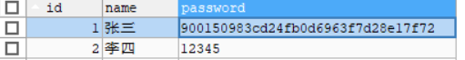

## 数据库加密

* MySQL中使用MD5加密
* MD5加密是不可逆的，具体的值得MD5是一样的


### 明文密码

```sql
INSERT INTO testmd5 VALUES(1,'张三','abc'),(2,'李四','12345')
```


### 加密

```sql
UPDATE testmd5 t SET t.password = MD5(t.password) WHERE id = 1
```

