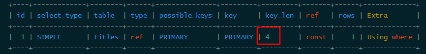

### 定义

* MySQL官方对索引的定义为：**索引（Index）是帮助MySQL高效获取数据的数据结构**。
  * 提取句子主干，就可以得到索引的本质：索引是数据结构。

### 分类

* 主键索引   primary key
  * 一个表中只能有一个
  * 数据不能重复
* 唯一索引   unique key
  * 避免重复的列出现
* 常规索引   key/index
* 全文索引   fulltext    （MyISAM支持）

### 基本操作

```sql
show index from table_a

CREATE INDEX index_name ON table_a(column1,column2) 

drop index index_name on table_name ;
```

### 数据结构

* Hash类型
* 全文索引
* B+Tree索引

### B+Tree索引原理解析

主要查看该网站

http://blog.codinglabs.org/articles/theory-of-mysql-index.html

#### 0.树的基本定义

* 要理解B+Tree先对树做基本的定义（以下定义是为了方便描述，基本准确，但是还是要看数据结构的书籍学习）：

* **树**-是一种数据结构，它是由n（n>=0）个有限结点组成一个具有层次关系的集合。

  

* **结点**-图中的每个圆圈就是1个结点，结点可以是1个数，1个对象，1个集合。。。

  * 根结点-最开始的结点
  * 叶结点-最底部的结点
  * 内部结点-根和叶之间的结点

* **结点的度**-该结点的子节点的数量。见图中红色数字

* **结点的深度**-该结点位于第几层，比如途中叶结点的深度是3。

* **树的度**-MAX(结点的度)，最大的结点的度。

* **树的高度**-叶结点的深度。

#### 1.B-TREE

* 为了描述B-Tree，把每条数据都定义为1个数组【key，value】
  * key-就是PK，每条记录都不一样。
  * value-就是PK以外这条记录的所有数据。
* 那么一个高度为2的B-Tree就是下图的数据结构：


* B-Tree的性质

  * B-Tree的度---设为d---是大于1的一个正整数。
  * 非叶子节点：
    * 由n-1个key和n个指针组成，其中d<=n<=2d。
    * 指针为图中数字之间的空白，姑且先认为是一个空的数组。
  * 叶子节点：
    * 最少包含一个key和两个指针，最多包含2d-1个key和2d个指针，叶节点的指针均为null**（指针？？？）**
    * 具有相同的深度。
  * 所有结点：
    * key和指针互相间隔。
    * 节点两端是指针。
    * key从左到右非递减排列。
  * 指针：
    * 要么为null，要么指向子节点。
    * 子结点中的key一定是在指针左右两个值的范围内。
      * 比如上图中子节点20和49大于15，小于56。

* 以上性质，可以推理出

  a.如果对N个数据索引，高h的上限为
  $$
  \log_d((N+1)/2)
  $$
  b.其查找节点个数的渐进复杂度为

$$
O(\log_dN)
$$

​		c.B-Tree中按key检索数据的算法：从根节点进行二分查找，如果找到则返回对应节点的data，否则对相应区间的指针指向的节点递归进行查找，直到找到节点或找到null指针，前者查找成功，后者查找失败。

#### 2.B+TREE

* B-Tree有许多变种，其中最常见的是B+Tree


* 与B-Tree的不同点
  * 见图，非叶结点中，指针数量为n，而不是n+1。即：指针上限为2d而不是2d+1。
  * 内节点不存储data，只存储key；叶子节点不存储指针
  * **由于并不是所有节点都具有相同的域（域？？？），因此B+Tree中叶节点和内节点一般大小不同。这点与B-Tree不同，虽然B-Tree中不同节点存放的key和指针可能数量不一致，但是每个节点的域和上限是一致的，所以在实现中B-Tree往往对每个节点申请同等大小的空间。**

#### 3.带有顺序访问指针的B+Tree


* 做这个优化的目的是为了提高区间访问的性能，例如图4中如果要查询key为从18到49的所有数据记录，当找到18后，只需顺着节点和指针顺序遍历就可以一次性访问到所有数据节点，极大提到了区间查询效率。

#### 4.为什么使用B+Tree作为索引的结构

1. 索引生成的数据结构是存储在硬盘中的。
2. 硬盘的读取速度受到机械的限制（要把光盘转到相应的位置，还要把磁头转到相应的位置），因此要尽量减少IO的读写。


3. 根据B-Tree的定义，可知检索一次最多需要访问h个节点。数据库系统的设计者巧妙利用了磁盘预读原理，将一个节点的大小设为等于一个页，这样每个节点只需要一次I/O就可以完全载入。
   * 硬盘管理数据的最小单位是页，就是读、写、擦除的最小单位是页。
4. 每次新建节点时，直接申请一个页的空间，这样就保证一个节点物理上也存储在一个页里，加之计算机存储分配都是按页对齐的，就实现了一个node只需一次I/O。
5. B-Tree中一次检索最多需要h-1次I/O（根节点常驻内存），渐进复杂度为O(h)=O(logdN)O(h)=O(logdN)。一般实际应用中，出度d是非常大的数字，通常超过100，因此h非常小（通常不超过3）

* 红黑树这种结构（每个结点只有1个数据），h明显要深的多。由于逻辑上很近的节点（父子）物理上可能很远，无法利用局部性，所以红黑树的I/O渐进复杂度也为O(h)，效率明显比B-Tree差很多

#### 5.MySQL的InnoDB索引实现

* MyISAM索引实现实际不一样，但是这个引擎几乎不再使用了。
* 在InnoDB中，表数据文件本身就是按B+Tree组织的一个索引结构，这棵树的叶节点data域保存了完整的数据记录。这个索引的key是数据表的主键，因此InnoDB表数据文件本身就是主索引。


* 以看到叶节点包含了完整的数据记录。这种索引叫做聚集索引。
* 因为InnoDB的数据文件本身要按主键聚集，所以InnoDB要求表必须有主键（MyISAM可以没有）
* 如果没有显式指定，则MySQL系统会自动选择一个可以唯一标识数据记录的列作为主键，如果不存在这种列，则MySQL自动为InnoDB表生成一个隐含字段作为主键，这个字段长度为6个字节，类型为长整形。
  * 以上3点其实可以理解为，为了让叶结点的键值连续，必须要有一个主键。
* 因此用非单调的字段作为主键在InnoDB中不是个好主意，因为InnoDB数据文件本身是一颗B+Tree，非单调的主键会造成在插入新记录时数据文件为了维持B+Tree的特性而频繁的分裂调整，十分低效，而使用自增字段作为主键则是一个很好的选择。

#### 6.连续最左前缀原理

* 就是指对于多字段索引，查询时如果想启用该索引，关键字必须是该索引从最左的字段开始并且是连续的。
* 例如对于索引`index demo(a,b,c)`:

##### 情况1：全列匹配

* where a = 'a' and b='b' and c = 'c'
* 当按照索引中所有列进行**精确匹配**（这里精确匹配指“=”或“IN”匹配），索引可以被**完全使用**，效率**最高**。
* 理论上索引多顺序敏感，不过MySQL会自动对顺序调整。


##### 情况2：连续最左前缀匹配

* where a='a' 或 where a='a'  and b= 'b'
* 当查询条件**精确匹配**索引的左边一个或**连续**几个列时，索引可以被**部分使用**，效率**较高**。


##### 情况3：非连续最左前缀

* where a='a' and c = 'c'
* 由于跳开了b，因此只能索引被**部分使用**，使用部分是**a部分**，就是执行效率和where a='a'是一样的。
* **优化方式**：**隔离化优化方法**，该情况时，如果distinct b的数量不多，可以用b in (distinct b)把坑填上，这样就变成了情况1，可以**完全使用**索引。


##### 情况4：非最左前缀

* where b='b'
* 由于跳开了a，索引**无法使用**。


##### 情况5：like条件

* where a='a' and b like 'index%a'
* a部分的索引可以被完全使用，b部分通配符%不出现在开头，则可以用到索引。


##### 情况6：最左范围查询

* where a<'a' and b = ''
* 查询条件中，只有最左前缀是范围条件时，可以使用索引。
* 只能使用**最左前缀部分**的索引。


* 整型列，日期列使用between不作为范围查询

  * 比如a是整型，查询where a between 'x' and 'y'时，实际上执行的是a in ('x'....'y')
  * 或者a是日期，查询where a between '2018-01-01' and '2018-10-10'，实际上执行的是in。

  

##### 情况7：函数表达式

* where a = a and b +1 = 10000
* 函数表达式列无法使用索引。



#### 7.索引建立策略

* 由于索引本身要占用空间，同时索引会加重插入、删除和修改记录时的负担，另外，MySQL在运行时也要消耗资源维护索引，因此以下两种情况不要随意建立。

1. 记录比较少，例如一两千条甚至只有几百条记录的表。个人的经验是以2000作为分界线，记录数不超过 2000可以考虑不建索引，超过2000条可以酌情考虑索引。

2. 索引的选择性较低。

   * 所谓索引的选择性（Selectivity），是指不重复的索引值（也叫基数，Cardinality）与表记录数（#T）的比值：

     Index Selectivity = Cardinality / #T

     显然选择性的取值范围为(0, 1]，选择性越高的索引价值越大，这是由B+Tree的性质决定的。

#### 8.索引优化策略-前缀索引

* 前缀索引就是用列的前缀代替整个列作为索引key，当前缀长度合适时，可以做到既使得前缀索引的选择性接近全列索引，同时因为索引key变短而减少了索引文件的大小和维护开销。

* 例如，设一个表有两个字段，<first_name,last_name>。

* 对于三种索引建立方式，选择性如图：

  * (first_name)

    

  * (first_name,last_name)

    

  * (first_name,left(last_name,4))

    

  

* 这时候第三种索引和没有索引速度对比


* **前缀索引兼顾索引大小和查询速度，但是其缺点是不能用于ORDER BY和GROUP BY操作，也不能用于Covering index（即当索引本身包含查询所需全部数据时，不再访问数据文件本身）。**