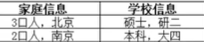
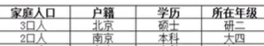
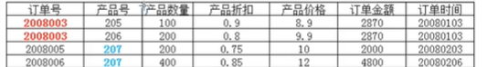
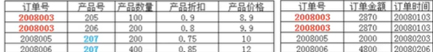
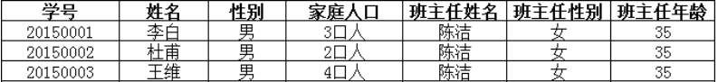
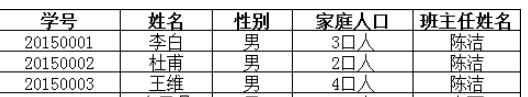

### 数据库优劣对比

#### 糟糕的数据库设计：

* 数据冗余，浪费空间
* 数据库插入和删除都会很麻烦，异常（不要使用物理外键）
* 程序的性能差

#### 良好的数据库设计：

* 节省内存空间
* 保证数据库的完整性
* 放i版我们开发系统

#### 软件开发中，关于数据库的设计

1. 分析需求
2. 概要设计

### 设计数据库的三大范式

#### 1.第一范式（1NF）

* 要求数据库每一列都是不可分割的原子数据项。

  ----->

#### 2.第二范式（2NF）

* 每张表只描述1件事情---针对联合主键，确保数据库表中的每一列都和主键相关，而不能只与主键和某一部分相关。

* 上图的表有两个特点
  * 1个订单有多个产品，产品的数量、折扣、价格不一样,**因此该部分的主键是订单号+产品号**,**是一个联合主键。**
  * 订单金额、订单时间只与订单号相关
* 因此上表应该拆成两个表（实际上，第二个表数据前2条数据只需要1条）

#### 3.第三范式（3NF）

* 确保数据表中的每一列数据都和主键直接相关，而不能间接相关

#### 4.优缺点分析

* 优点
  * 结构合理
  * 冗余较小
  * 尽量避免插入删除修改异常
* 缺点
  * 性能降低
  * 多表查询比单表查询速度慢
* 在实际设计中，要整体遵循范式理论，但是要适当增加冗余字段，减少多表查询。
* 增加计算列，直接计算总数，统计时就不用计算，直接查该条数据。
* **阿里的规范中，联表查询不能超过3个。**

