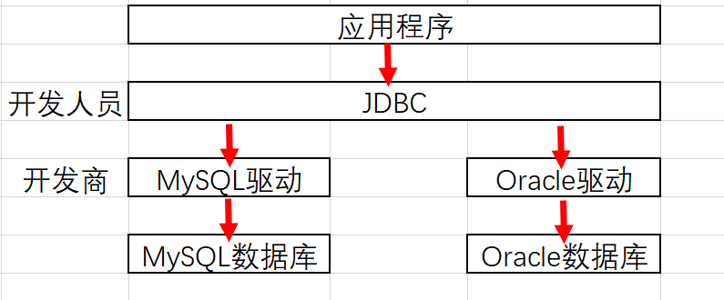
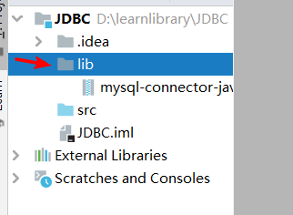
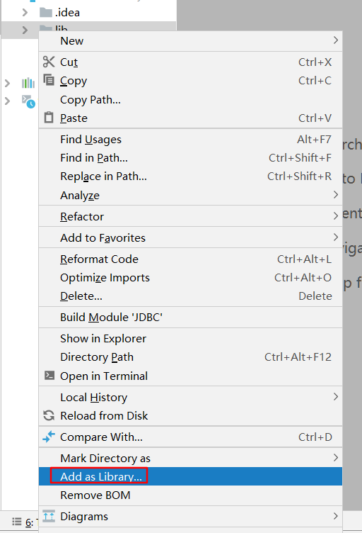
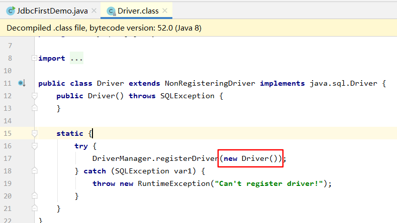
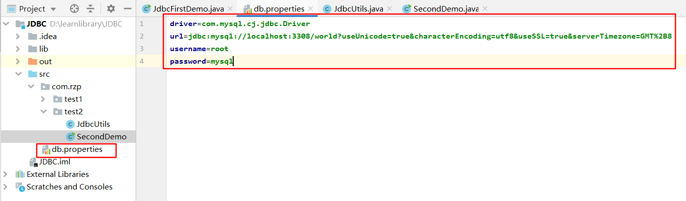
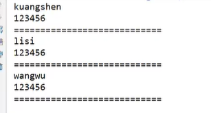
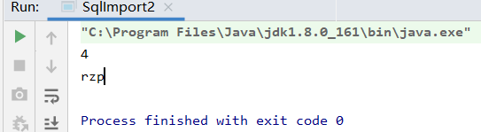

### 1.驱动

* 应用程序链接数据库需要驱动。
* 不同数据库使用不同的驱动。

### 2.JDBC概念

* SUN公司为了简化开发人员操作，提供了一个Java操作数据库的规范，俗称JDBC。
* 规范的实现由具体厂商去做。
* 开发人员只需要掌握JDBC接口。



* JDBC的包
  * java.sql
  * javax.sql
  * 对应苏剧库驱动包

### 3. JDBC连接步骤

1. 创建一个空白项目
   * IDEA 中new一个项目

2. 导入JAR包

   * 在项目中创建lib目录

     

   * 把对应的jar包放入

   * 选定lib文件夹，add as library

     

3. 编写测试代码
   * 使用MySQL 8安装后自带的示例数据库

```java
package com.rzp.test1;

import java.sql.*;
import java.util.Iterator;

public class JdbcFirstDemo {
    public static void main(String[] args) throws ClassNotFoundException, SQLException {
        //1.加载驱动
        Class.forName("com.mysql.cj.jdbc.Driver");//固定写法，通过反射加载驱动
        //2.用户信息和url
        //useUnicode=true--支持中文编码;characterEncoding=utf8--字符集编码;useSSL=true--使用安全连接;serverTimezone=GMT%2B8-时区问题
        String url = "jdbc:mysql://localhost:3308/world?useUnicode=true&characterEncoding=utf8&useSSL=true&serverTimezone=GMT%2B8";
        String username = "root";
        String password = "mysql";
        //3.连接数据库，返回Connection数据库对象
        Connection connection = DriverManager.getConnection(url, username, password);

        //4.通过createStatement方法，创建statement的对象,用来执行SQL
        Statement statement = connection.createStatement();

        //5.执行SQL的对象去执行SQL
        String sql = "SELECT t.* FROM city t WHERE t.`District` LIKE 'Chi%'";

        //查询sql后通过ResultSet获取结果
        ResultSet rs = statement.executeQuery(sql);
        while (rs.next()){
            System.out.println("id="+rs.getObject("id"));
            System.out.println("name="+rs.getObject("name"));
            System.out.println("countrycode="+rs.getObject("countrycode"));
            System.out.println("District="+rs.getObject("District"));
            System.out.println("Population="+rs.getObject("Population"));
            System.out.println();
        }
        //6.释放连接
        rs.close();
        statement.close();
        connection.close();
    }
}

```

输出结果:

```java
id=151
name=Chittagong
countrycode=BGD
District=Chittagong
Population=1392860

id=160
name=Comilla
countrycode=BGD
District=Chittagong
Population=135313
...
```

### 4. JDBC连接对象分析

#### 1.驱动

```java
Class.forName("com.mysql.cj.jdbc.Driver");//固定写法，通过反射加载驱动
```

* 查看Drive源码可以知道，Drive中由静态代码块实例化了一个对象，因此只要加载该类，就可以创建实例化的对象

  

旧的写法是:

* 这样就实例化了2次

```java
        DriverManager.registerDriver(new com.mysql.cj.jdbc.Driver() );
```


#### 2. URL

* MySQL:

  协议：//主机地址：端口号/数据库名？参数1&参数2&参数3

```java
        //useUnicode=true--支持中文编码;characterEncoding=utf8--字符集编码;useSSL=true--使用安全连接;serverTimezone=GMT%2B8-时区问题
        String url = "jdbc:mysql://localhost:3308/world?useUnicode=true&characterEncoding=utf8&useSSL=true&serverTimezone=GMT%2B8";
```

* Oracle：

```java
// jdbc:oracle:thin:@localhost:1521:sid
```

#### 3. 连接对象

* Connection 代表数据库
* 可以执行数据库的函数（方法）
  * 事务提交
  * 事务回滚

```java
        Connection connection = DriverManager.getConnection(url, username, password);

        connection.rollback();
        connection.commit();
        connection.setAutoCommit(true);

```

#### 4.执行SQL对象

* Statement

* 该对象不安全，姑且先用。

* PrepareStatement 也是执行SQL的对象，后文再详细说明。

  ```java
          Statement statement = connection.createStatement();
  
          statement.executeQuery();//查询操作，返回ResuleSet
          statement.execute();//执行任何SQL，因为要判断是查询还是增删改，所以效率较低
          statement.executeUpdate();//更新、插入、删除，都用这个，返回受影响的函数
  
  ```

  

#### 5. 结果集对象

* ResultSet

* 结果集对象，封装了查询结果

  ```java
          //查询sql后通过ResultSet获取结果
          ResultSet rs = statement.executeQuery(sql);
  
          rs.getObject(); //不知道列类型的时候使用
          rs.getString(); //知道具体对象最好使用这个
          rs.getInt();
          ......
  
          //移动指针
          rs.beforeFirst(); //移动到最前端
          rs.afterLast();   //移动到最后面
          rs.next();        //移动到下一个数据
          rs.previous();    //移动到前一个数据
          rs.absolute(row); //移动到指定行
  		
  		//显然，会返回布尔值
          while (rs.next()){...}
  ```

#### 6. 释放连接

* Connection非常占用内存

  ```java
          //6.释放连接
          rs.close();
          statement.close();
          connection.close();
  ```

### 5.提取工具类

* 为了避免每次连接数据库都要重新写一遍调用的代码，因此要把以上代码封装成一个方法。

#### 1.创建db.properties文件，并填入URL等信息



```java
driver=com.mysql.cj.jdbc.Driver
url=jdbc:mysql://localhost:3308/world?useUnicode=true&characterEncoding=utf8&useSSL=true&serverTimezone=GMT%2B8
username=root
password=mysql
```

#### 2.创建工具类JdbcUtils，通过输入流读取URL，封装建立链接的方法

```java
package com.rzp.test2;
import java.io.InputStream;
import java.sql.*;
import java.util.Properties;

public class JdbcUtils {
    private static String driver=null;
    private static String url=null;
    private static String username=null;
    private static String password=null;
    static {
        try{
            //通过输入流读取配置文件
            InputStream in = JdbcUtils.class.getClassLoader().getResourceAsStream("db.properties");
            Properties properties = new Properties();
            properties.load(in);
            driver = properties.getProperty("driver");
            url = properties.getProperty("url");
            username = properties.getProperty("username");
            password = properties.getProperty("password");
            //1.驱动只用加载一次
            Class.forName(driver);
        } catch (Exception e) {
            e.printStackTrace();
        }
    }


    //获取连接
    public static Connection getConnection() throws SQLException {
        return DriverManager.getConnection(url,username,password);
    }

    //释放连接
    public static void closeConnection(Connection connection, Statement statement, ResultSet resultSet) {
        if (resultSet!=null){
            try {
                resultSet.close();
            } catch (SQLException e) {
                e.printStackTrace();
            }
        }
        if (statement!=null){
            try {
                statement.close();
            } catch (SQLException e) {
                e.printStackTrace();
            }
        }
        if (connection!=null){
            try {
                connection.close();
            } catch (SQLException e) {
                e.printStackTrace();
            }

        }
    }

}

```


#### 3.实际使用的时候，只需要调用JdbcUtils就可以直接链接了

```java
public class SecondDemo {
    public static void main(String[] args) {
        Connection conn = null;
        Statement st = null;
        ResultSet rs = null;
        String sql = "";

        try {
            conn = JdbcUtils.getConnection();
            st = conn.createStatement();
            rs = st.executeQuery(sql);
        } catch (SQLException e) {
            e.printStackTrace();
        }finally {
            JdbcUtils.closeConnection(conn,st,rs);
        }
    }
}
```


#### 4.进而，可以封装成一个查 Sql 的方法

```java
public class ConnectionFunction {
    public static ResultSet doStanderQuery(String sql) {
        Connection conn = null;
        Statement st = null;
        ResultSet rs = null;
        try {
            conn = JdbcUtils.getConnection();
            st = conn.createStatement();
            rs = st.executeQuery(sql);
        } catch (SQLException e) {
            e.printStackTrace();
        }finally {
            JdbcUtils.closeConnection(conn,st,rs);
        }
        return rs;
    }
}
```

那么实际业务代码只需要：

* 未经过测试，理论可行，实际可能还有其他问题。

```java
    public void test(){
        String sql = "";
        ResultSet rs = ConnectionFunction.doStanderQuery(sql);
    }

```

#### 5.同理，修改、查询、删除都是一样。

### 6. SQL注入问题

* Sql存在漏洞，拼接后导致数据泄露
* 比如以下方法

```java
public class SqlImport {
    public static void main(String[] args) {
        String test = login("rzp","123");
        System.out.println(test);
    }

    //登录业务
    public static String login(String name, String password){
        String sql = "select * from users where name = '"+name+"' and password = '"+password+"'";
        return sql;
    }
}

```

输出结果为：

```java
select * from users where name = 'rzp' and password = '123'
```

表面上看没有问题，但是如果用户输入的是`'or'1=1'`:

```java
    public static void main(String[] args) {
        String test = login("'or'1=1","'or'1=1");
        System.out.println(test);
    }

```

输出:

```java
select * from users where name = ''or'1=1' and password = ''or'1=1'
```

这时候就会由于语句执行成功，输出了所有用户名密码，导致信息泄露



### 7. PreparedStatement

* 为了防止SQL注入问题，引入了PreparedStatement，并且这个效率更高。

#### 1.写法

```java
package com.rzp.test3;

import com.rzp.test2.JdbcUtils;
import java.util.Date;
import java.sql.*;

public class TestInsert {
    public static void main(String[] args) {
        Connection conn = null;
        PreparedStatement pst = null;
        ResultSet rs = null;

        try {
            conn = JdbcUtils.getConnection();
            //区别:使用？占位符代替参数
            String sql = "insert into user (id,username,userpassword,email,birthday) values (?,?,?,?,?)";
            pst = conn.prepareStatement(sql);
            //手动给参数赋值
            pst.setInt(1,4);
            pst.setString(2,"rzp");
            pst.setString(3,"132");
            pst.setString(4,"6546");
            pst.setDate(5,new java.sql.Date(new Date().getTime()));

            //执行
            int i = pst.executeUpdate();
            System.out.println("插入"+i+"条记录");
        } catch (SQLException e) {
            e.printStackTrace();
        }finally {
            JdbcUtils.closeConnection(conn,pst,rs);
        }
    }

}

```

#### 2.原理解析

* PreparedStatement防止SQL注入的本质，把传递进来的参数当作字符.
* 转义字符会被忽略，即单引号会被忽略
* 然后再把参数两边加上单引号

```java
package com.rzp.test3;

import com.rzp.test2.JdbcUtils;

import java.sql.Connection;
import java.sql.PreparedStatement;
import java.sql.ResultSet;
import java.sql.SQLException;
import java.util.Date;

public class SqlImport2 {
    public static void main(String[] args) {
        login("rzp","132");
        login("'' or 1=1","132");
    }
    public static void login(String username,String password){
        Connection conn = null;
        PreparedStatement pst = null;
        ResultSet rs = null;

        try {
            conn = JdbcUtils.getConnection();
            //区别:使用？占位符代替参数
            //PreparedStatement防止SQL注入的本质，把传递进来的参数当作字符
            //转义字符会被忽略，即单引号会被忽略
            String sql = "select * from user where `username` = ? and `userpassword` = ?";
            pst = conn.prepareStatement(sql);
            //手动给参数赋值
            pst.setString(1,username);
            pst.setString(2,password);
            //执行
            rs = pst.executeQuery();
            while (rs.next()){
                System.out.println(rs.getObject(1));
                System.out.println(rs.getObject(2));
            }
        } catch (SQLException e) {
            e.printStackTrace();
        }finally {
            JdbcUtils.closeConnection(conn,pst,rs);
        }
    }
}
```

如下：无法再通过SQL注入来输出了

