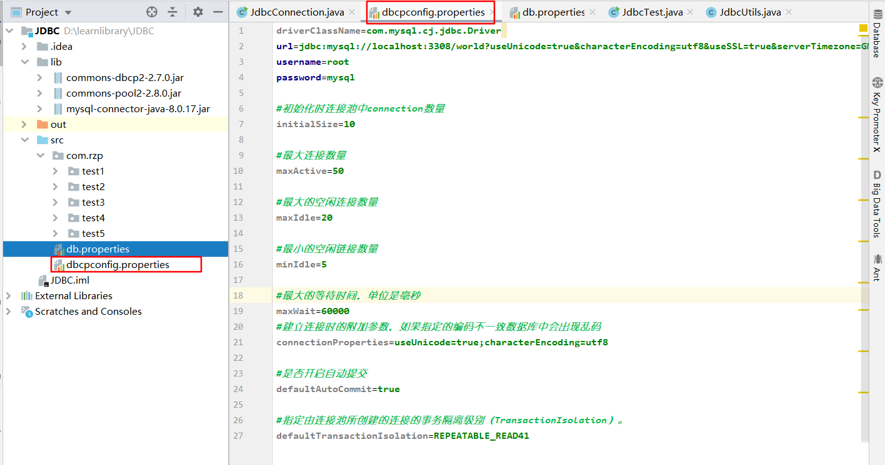

### 1. 定义

* 池化技术（和线程池类似）：准备一些预先的资源，直接使用，使用完也不用释放。
* 原因：数据库连接-释放--非常消耗资源，因此使用池化技术。
* 关键要素：
  * 最小连接数：业务常用数量。
  * 最大连接数：业务最高承载上限。
  * 等待超时：100ms 超过这个等待时间，就拒绝这个连接。

* 代码实现：DataSource接口
* 实现类：
  * 开源数据源实现
  * DBCP
  * C3P0
  * Druid：阿里巴巴
* 使用数据库连接池后，就不需要编写连接数据库的代码了

### 2. DBCP

* 导入jar包

  

* 设置dbcp的properties文件



```java
driverClassName=com.mysql.cj.jdbc.Driver 
url=jdbc:mysql://localhost:3308/world?useUnicode=true&characterEncoding=utf8&useSSL=true&serverTimezone=GMT%2B8
username=root
password=mysql

#初始化时连接池中connection数量
initialSize=10

#最大连接数量
maxActive=50

#最大的空闲连接数量
maxIdle=20

#最小的空闲链接数量
minIdle=5

#最大的等待时间，单位是毫秒
maxWait=60000
#建立连接时的附加参数，如果指定的编码不一致数据库中会出现乱码
connectionProperties=useUnicode=true;characterEncoding=utf8

#是否开启自动提交
defaultAutoCommit=true

#指定由连接池所创建的连接的事务隔离级别（TransactionIsolation）。
defaultTransactionIsolation=REPEATABLE_READ41
```


* 代码实现
  * 和JDBC连接其实类似，只是要使用dbcp的BasicDataSourceFactory创建数据源，然后直接使用数据源获取连接就可以了。
  * 使用完以后也是要释放连接，只是释放后会放回dbcp的连接池里。

```java
package com.rzp.test5;

import org.apache.commons.dbcp2.BasicDataSource;
import org.apache.commons.dbcp2.BasicDataSourceFactory;

import java.io.InputStream;
import java.sql.*;
import java.util.Properties;

public class JdbcUtilsDbcp {
    private static BasicDataSource dataSource = null;
    static {
        try{
            //通过输入流读取配置文件
            InputStream in = JdbcUtilsDbcp.class.getClassLoader().getResourceAsStream("dpcpconfig.properties");
            Properties properties = new Properties();
            properties.load(in);
            //创建数据源
            dataSource = BasicDataSourceFactory.createDataSource(properties);
        } catch (Exception e) {
            e.printStackTrace();
        }
    }


    //从数据源直接获取获取连接
    public static Connection getConnection() throws SQLException {
        return dataSource.getConnection();
    }

    //释放连接
    public static void closeConnection(Connection connection, Statement statement, ResultSet resultSet) {
        if (resultSet!=null){
            try {
                resultSet.close();
            } catch (SQLException e) {
                e.printStackTrace();
            }
        }
        if (statement!=null){
            try {
                statement.close();
            } catch (SQLException e) {
                e.printStackTrace();
            }
        }
        if (connection!=null){
            try {
                connection.close();
            } catch (SQLException e) {
                e.printStackTrace();
            }

        }
    }

}

```


### 3. C3P0